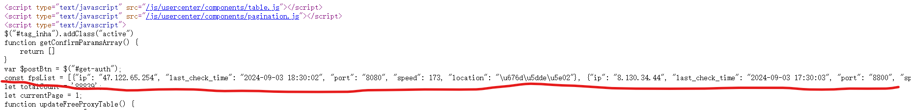

## Project Overview
### Introduction
This project implements a proxy pool that can automatically crawl, validate, store free public proxy IPs on the internet, and provides a simple Flask-based API for obtaining proxy IPs. At the same time, using the schedule module, it implements scheduled crawling and detection of proxies to ensure the timeliness and availability of proxy IPs.

This project is a secondary development based on the following project:
https://github.com/WorldObserver/IPProxyPool

### What is a Proxy
A web scraper is an automated program that extracts data from target websites. To prevent their data from being scraped, websites often use IP blocking as a common anti-scraping measure. This means that when a website detects excessive and frequent access from the same IP address, it will restrict access from that IP.

To bypass IP blocking, using proxy IPs is an effective method. By switching between different proxy IPs, the target site cannot detect that the same IP is making requests, thus enabling smooth data collection.

### What is a Proxy Pool
Free proxies available on the internet are highly unstable with a low percentage of usable ones. Therefore, it is necessary to batch-crawl these proxy IPs to form a "pool" of proxy IPs and regularly test them to confirm their availability. Usable proxy IPs are prioritized, while unavailable ones have their priority reduced until they are deleted. This ensures that high-quality, available proxy IPs can be consistently obtained from the "pool".

### Development Environment
- Language: Python 3
- Main Dependencies:
    - requests: Send requests and fetch page data
    - lxml: Parse pages and extract target data using XPath
    - pymongo: Store extracted proxy IP data in MongoDB database and read proxy IPs for use by web scrapers
    - flask: Provide Web API to easily obtain qualified proxy IPs.
- Installation via pip command: pip install requests lxml pymongo flask


## Project Structure
The project is divided into five core modules:

### Crawler Module: proxy_spiders
Responsible for collecting free proxy IPs provided by free proxy IP websites, with the following workflow:
1. Collect proxy IPs from websites.
2. Validate proxy IPs (using validation module) to get their response speed, supported protocol types (http or https), and anonymity level.
3. Store validated and confirmed available proxy IPs in the database.

### Validation Module: proxy_validate
Responsible for validating proxy IP response speed, supported protocol types (http or https), and anonymity level.
- Reason for validation: Although websites may indicate proxy IP response speed, protocol type, and anonymity level, the accuracy cannot be guaranteed, so self-validation is required.
- Validation method: Use httpbin.org for validation. This website returns detailed request information, allowing judgment of the real status of the proxy IP.

### Database Module: db
Responsible for storing available proxy IPs and providing CRUD operations.
- Database uses MongoDB.

### Testing Module: proxy_test.py
Responsible for regularly reading proxy IPs from the database and validating them using the validation module to ensure proxy IP availability.
The specific workflow is as follows:
1. Read all proxy IPs from the database
2. Validate proxy IPs one by one. (Because there may be many proxy IPs, multiple coroutines can be started for asynchronous validation to improve detection efficiency)
3. If a proxy IP is currently unavailable, reduce its score by 1. When the score reaches 0, delete the proxy IP from the database. If a proxy IP is found to be available, restore its score to the default value (configurable in the configuration file).
    - The score of a proxy IP is an indicator of its stability. Higher scores represent higher stability and better availability.

### Web Service Interface Module: proxy_api.py
Responsible for providing proxy IPs to web scrapers in a simple and convenient way.
The following Web interfaces are available:
- Get a random high-quality proxy IP based on supported protocol type (http or https) and supported domain.
- Get multiple random high-quality proxy IPs based on supported protocol type (http or https) and supported domain.
- Add the specified domain to the unavailable domain list of the specified proxy IP. The unavailable domain list indicates that this proxy IP is not available under these domains. This way, when obtaining available proxy IPs for this domain next time, this proxy IP will not be returned, further ensuring proxy IP availability.

In addition to the above five core modules, there are also some auxiliary modules:

### Data Model Module: model.py
Responsible for defining the data model of the proxy IP object, encapsulating proxy IP related information, such as ip, port, response speed, supported protocol type, anonymity level, and score.

### Program Startup Entry Module: main.py
Responsible for providing a unified startup entry for the entire proxy pool project.

### Utility Module: utils
Responsible for providing logging functionality and random request headers
- Logging module: Configure logging and provide a logging object to record log information.
- Http module: Provide request headers with random User-Agent to reduce the probability of being identified as a web scraper by websites.

### Configuration File: settings.py
Responsible for project configuration information, mainly including:
- Default score for proxy IPs
- Log format and level
- List of crawlers to start
- Interval time for detecting crawlers
- Database connection information, etc.

### Project File Structure
        -- IPProxyPool
            -- core
                -- db
                    -- __init__.py
                    -- mongo_pool.py
                -- proxy_validate
                    -- __init__.py
                    -- httpbin_validator.py
                -- proxy_spiders
                    -- __init__.py
                    -- base_spider.py
                    -- proxy_spiders.py
                    -- run_spiders.py
                -- proxy_test.py
                -- proxy_api.py
            -- model.py
            -- utils
                -- __init__.py
                -- http.py
                -- log.py
            -- main.py
            -- settings.py

## General Project Workflow
- Crawler Module: Collect proxy IPs -> Validate proxy IP availability -> Store available ones in database.
- Testing Module: Read proxy IPs from database -> Validate proxy IP availability -> Update or delete proxy IPs based on validation results.
- Proxy API Module: Obtain high-quality proxy IPs from the database based on provided protocol type and domain for use by web scrapers.

## Command to Start the Project
```bash
cd /your_path/IPProxyPool
python main.py
```

## How to Use Web API
Get a highly available random proxy IP: `localhost:1688/random?protocol=https&domain=jd.com`
    
    - You can specify the required protocol and domain. If no protocol is specified, the default is to return proxy IPs that support both http and https. If no domain is specified, it will not be used as a filtering criterion.

Get multiple highly available proxy IPs: `localhost:16888/proxies?protocol=https&domain=jd.com`
    
    - Similarly, you can specify or not specify protocol and domain query parameters.

Note: 16888 needs to be replaced with the port number you configured in the configuration file. The configuration item is: WEB_API_PORT

## Code Implementation Details
In the entire project, the crawler module, testing module, and Web service API module are the three most core modules, playing a backbone role in the entire project's operation. In particular, the crawler module provides high extensibility and configurability for the data collection process. Therefore, it is necessary to emphasize the implementation details of these three modules here.

### Implementation Details of the Crawler Module
#### Purpose and Implementation Requirements
The crawler module is responsible for fetching free proxy IPs from proxy IP websites, validating them, and storing available proxy IPs in the database.

#### Design of the Crawler Module
Because many proxy IP websites on the internet have very similar web structures and URL patterns for list pages are also regular, the code for crawling a proxy IP website is also highly similar and reusable. Therefore, a generic crawler class can be defined to provide basic methods and attributes, while specific crawler classes for a particular website can inherit the generic crawler and slightly override specific methods or attributes according to the specific situation.

This way, the reusability and extensibility of crawlers are greatly improved.

#### Structure of Generic Crawler (base_spider.py)
- Define three class attributes: URL list, group xpath, and detail xpath, representing the URL list of list pages of the website to be crawled, the xpath to extract the group tag containing proxy IPs, and the detail xpath to extract specific information (ip, port, area) from within the group tag.
    - The purpose of these three class attributes is to be overridden when specific crawlers inherit the generic crawler to achieve customization.
- Provide an initialization method so that the generic crawler can also be used independently without inheritance.
- Define a get_proxies() method for crawling proxy IPs from websites.
    1. First, iterate through the URL list.
    2. Send requests according to the current URL to get page data (using get_page_form_url() method).
    3. Parse the page, extract proxy IP information, package as Proxy objects, and return Proxy object generators (using get_proxies_from_page() method).
- Code implementation example:
    ```python
    class BaseSpider:

        urls = []
        group_xpath = ''
        detail_xpath = {}

        def __init__(self, urls=[], group_xpath='', detail_xpath={}):
            if urls:
                self.urls = urls
            if group_xpath:
                self.group_xpath = group_xpath
            if detail_xpath:
                self.detail_xpath = detail_xpath

        def get_page_from_url(self, url):
            ...
        
        def get_proxies_from_page(self, page):
            ...

        def get_proxies(self):
            ...
    ```

#### Implementation of Specific Crawlers in General Cases
In general cases, proxy IP websites have similar structures, so by inheriting the generic crawler class and overriding the URL list, group xpath, and detail xpath in the specific crawler class, proxy IP crawling can be achieved.

Taking the ProxyListPlusSpider specific crawler class as an example, its code structure is roughly as follows:
```python
class ProxyListPlusSpider(BaseSpider):
    """Crawler class for scraping ProxyListPlus website"""
    # List page URL list
    urls = [f"https://list.proxylistplus.com/Fresh-HTTP-Proxy-List-{i}" for i in range(1, 7)]
    # Group XPATH
    group_xpath = '//*[@id="page"]/table[2]/tr[position() > 2]'
    # Detail XPATH
    detail_xpath = {
        "ip": "./td[2]/text()",
        "port": "./td[3]/text()",
        "area": "./td[5]/text()",
    }
```

#### Implementation of Specific Crawler Classes in Special Cases
Sometimes, the structure of the proxy IP website cannot be simply obtained through a combination of group xpath and detail xpath, so the get_proxies_from_page() method needs to be overridden to customize the page parsing logic to get proxy IPs.

Taking Kuaidaili (Fast Proxy) as an example, proxy IPs on its page are written in JavaScript code and rendered to the page through JS code, as shown:

Therefore, the parsing logic needs to be overridden to extract proxy IP information using regular expressions, as shown in the following code implementation:
```python
def get_proxies_from_page(self, page):
        """Extract ip, port and area from page and return encapsulated Proxy object"""
        # If page is empty, log the error and end method execution
        if page is None:
            logger.exception(f"Failed to retrieve page")
            return
        # Decode the passed page parameter (bytes type) to get page content
        html_str = page.decode()
        # Use regular expression to extract string containing proxy IP information
        ip_list_str = re.search(r'const fpsList = (\[.*?\]);', html_str, re.S).group(1)
        # Convert string to json object (list of dictionaries containing proxy IP information)
        ip_list_json = json.loads(ip_list_str)
        # Iterate through this list
        for item in ip_list_json:
            # Extract ip
            ip = item['ip']
            # Extract port
            port = item['port']
            # Extract area
            area = item['location']
            # Return Proxy object
            yield Proxy(ip, port, area=area)
```

#### Logic of Crawler Scheduling
run_spiders.py is responsible for unified scheduling and startup of various specific crawlers.
Its features are:
- Dynamically invoke crawler module names from configuration file information to achieve high configurability and flexibility of startup scheduling crawlers.
- Crawlers are network I/O intensive programs, so coroutine pools are used to concurrently schedule multiple crawlers, greatly improving crawling efficiency.
The code implementation is roughly as follows:
```python
def get_spider_from_settings(self):
    """According to configuration file information, return list of crawler objects"""
    for path in PROXIES_SPIDERS:
        # Parse crawler module name and crawler class name from configuration string
        module_name, cls_name = path.rsplit('.', maxsplit=1)
        # Dynamically load crawler module
        module = importlib.import_module(module_name)
        # Get crawler object from crawler module
        spider_cls = getattr(module, cls_name)
        # Create crawler instance and return via generator
        spider = spider_cls()
        yield spider

def __execute_one_spider_task(self, spider):
    """Extract code to handle one crawler into this method"""
    # Handle exceptions to prevent one crawler from failing and affecting other crawlers. 
    try:
        # Iterate through crawler object's get_proxies method to get Proxy objects corresponding to proxy IPs
        for proxy in spider.get_proxies():
            # Test proxy IP (proxy IP testing module)
            print(f'Testing: {proxy}')
            proxy = check_proxy(proxy)
            # If proxy IP is available (speed is not -1), save to database
            if proxy.speed != -1:
                self.mongo_pool.insert_one(proxy)
    # Catch exceptions and print exception information
    except Exception as e:
        logger.exception(e)


def run(self):
    """Provide a run method for running crawlers as an entry point for running crawlers, implementing core processing logic
    """
    # Get crawler object generator
    spiders = self.get_spider_from_settings()
    # Iterate through crawler objects
    for spider in spiders:
        # Execute each crawler's task using asynchronous coroutines
        self.gevent_pool.apply_async(self.__execute_one_spider_task, args=(spider, ))
    # Block main thread to wait for all coroutine tasks to complete
    self.gevent_pool.join()
```
In addition, the schedule module is used to implement periodic startup of crawlers to ensure the timeliness of crawling proxy IPs. The cycle for starting crawlers can also be configured in the configuration file.

### Implementation Details of Testing Module
The testing module is responsible for regularly testing the validity of proxy IPs in the database, updating or deleting proxy IPs to ensure high availability of proxy IPs in the database.
The actual implementation features are as follows:
- Because there may be many proxy IPs in the database, concurrent coroutines are also used to improve testing efficiency. However, at the same time, too many proxy IPs cannot have a separate coroutine for each testing task. Therefore, the logic here is to first create a coroutine pool with a reasonable number of coroutines, and then the testing tasks in it continuously update themselves with callback functions. When a testing task ends, the current position in the coroutine pool is immediately replaced by a new testing task. This way, efficiency is guaranteed through concurrency without overloading resources.
- Use queues to pass Proxy objects to achieve communication between coroutines.

The code implementation is roughly as follows:
```python
def run(self):
        """Core logic for executing the proxy IP testing process"""
        # Get all proxy IP proxy objects from database
        proxies = self.mongo_pool.find_all()
        # Iterate through proxy objects
        for proxy in proxies:
            # Put proxy to be tested into queue
            self.queue.put(proxy)
        # Create concurrent coroutines in coroutine pool according to configured concurrency count
        for _ in range(TEST_PROXY_ASYNC_COUNT):
            # Add method to test one proxy to coroutine pool and specify callback function
            self.gevent_pool.apply_async(
                self.__check_one_proxy, callback=self.__check_callback
            )
        # Block thread to wait for all tasks in queue to complete
        self.queue.join()

def __check_callback(self, temp):
    """Callback function
    Continuously call itself to achieve a loop (continuously add proxy testing method to coroutine pool)
    """
    self.gevent_pool.apply_async(
        self.__check_one_proxy, callback=self.__check_callback
    )
```
The `self.__check_one_proxy()` in the code is the specific method for testing one proxy IP, and the details are not elaborated here.
In addition, the testing module also uses the schedule module to implement periodic startup.

### Web API Module Implementation Details
The Web API module uses Flask to build a local simple server. By accessing the server on the local port and carrying `protocol` and `domain` parameters to specify the protocol and domain supported by the proxy IP, you can obtain a random proxy IP from the database, get multiple proxy IPs, and add a domain to the unavailable domain list of the specified proxy IP.

The specific code implementation will not be elaborated here.
